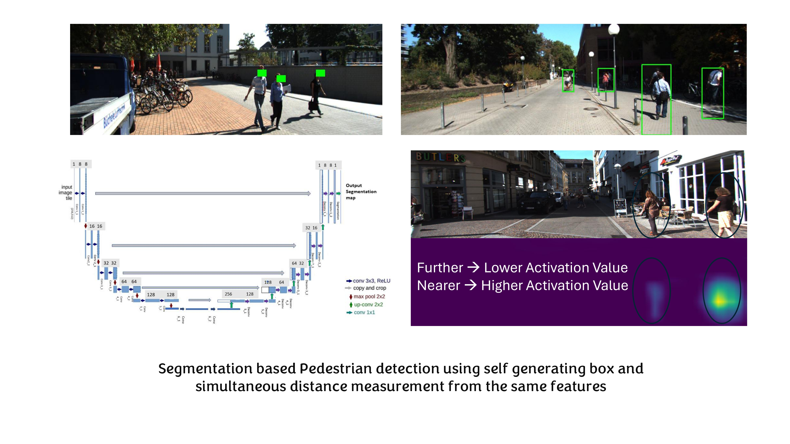

# Pedestrian_Detection

## Project Overview

This project presents a computer vision and machine learning pipeline for **pedestrian detection**. The workflow begins with raw input images or video frames and processes them through preprocessing and detection models to identify pedestrians. The final goal is to accurately localize pedestrians using bounding boxes for applications such as autonomous driving, surveillance, and robotics.

The repository is organized around two main stages:

1. **Image preprocessing and pedestrian detection**
2. **Post-processing, visualization, and evaluation**

### Important Code Files

#### `main.py`
This is the main execution script of the project. It handles loading input data (images or video), initializing the pedestrian detection pipeline, and running inference. It also manages visualization and saving of detection outputs.

Key responsibilities:
- Parse input arguments (image/video path)
- Load input frames
- Call detection functions
- Display or save output results with bounding boxes

---

#### `detector.py`
This file implements the core pedestrian detection algorithm. It applies the trained detection model or feature-based approach to each frame and identifies pedestrian regions.

Key responsibilities:
- Load or initialize the detection model
- Process each frame/image
- Perform detection using sliding window or model inference
- Generate bounding boxes with associated confidence scores

---

#### `utils.py`
This file provides supporting utility functions used across the pipeline.

Key responsibilities:
- Image preprocessing (resizing, normalization)
- Drawing bounding boxes and annotations
- Filtering overlapping detections (e.g., thresholding or suppression)
- Helper functions for handling image/video data

---

#### `model/`
This directory contains the trained model files or configuration parameters used for pedestrian detection. These models are used during inference to detect pedestrians in input frames.

---

#### `data/`
This directory contains sample input images or videos used for testing and evaluation of the detection pipeline.

---

### Overall Pipeline

The complete project workflow can be summarized as:

**Input image / video frame**  
→ **Image preprocessing**  
→ **Feature extraction / model inference**  
→ **Pedestrian detection**  
→ **Bounding box generation**  
→ **Post-processing (filtering / suppression)**  
→ **Final detection visualization**  

### Repository Outputs

The repository generates:
- Images or video frames with detected pedestrians
- Bounding boxes around pedestrians
- Confidence scores for each detection
- 
## System Setup

Run the following steps to set up the system.

* Create a new environment
  * `conda create --name pedestrian python=3.9`
* Activate the environment
  * `conda activate pedestrian`
* Change to the directory where you want to download the files
  * `cd Directory`  
    Example: `cd C:/Users/tushar/Documents`
* Clone the repository
  * `git clone https://github.com/stushar047/Pedestrian_Detection.git`
* Move into the repository
  * `cd Pedestrian_Detection`
* Install the required libraries
  * `pip install tensorflow numpy pandas matplotlib opencv-python`

## Run the code

* For running the code, always make sure that you are in the correct environment and directory 
  * conda activate pedestrian
  * cd Pedestrian_Detection
* Run the code
  * python main.py --input <path_to_image_or_video>
  * Example: python main.py --input data/sample.jpg

## Collect all the files required

There will be two types of outputs:

1. Image / Video outputs 
Output files include images or video frames with detected pedestrians and bounding boxes.

2. Detection results 
Bounding boxes and confidence scores for detected pedestrians.

## Check the results

* Run the code and verify:
  * Bounding boxes correctly detect pedestrians
  * False detections are minimal
  * Detection consistency across frames (for video)

## Paper References
- MS Thesis References - https://digital.library.txst.edu/items/28c90d7f-cc88-4358-a654-9b46173ffac6
